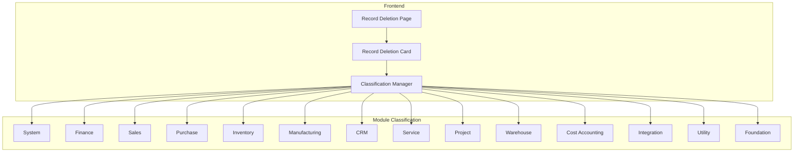
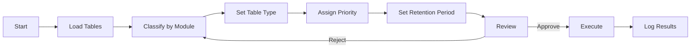
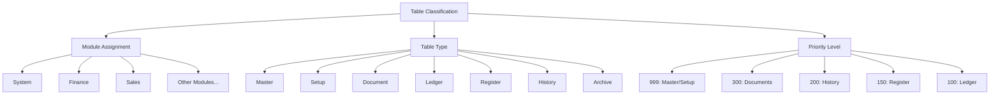
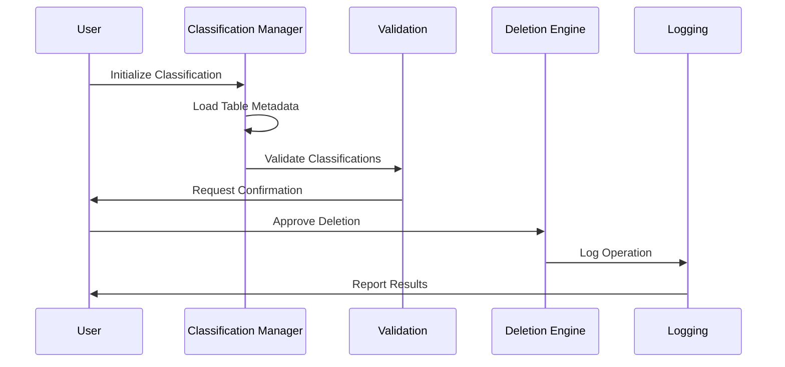
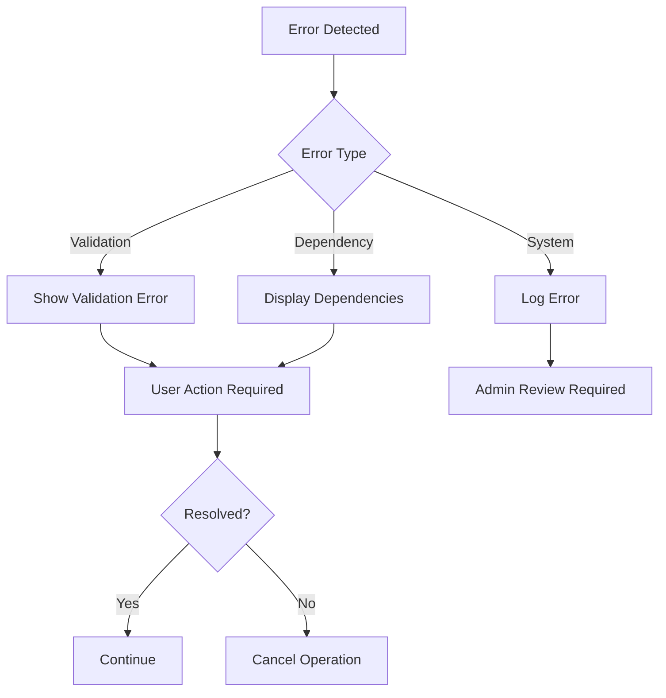
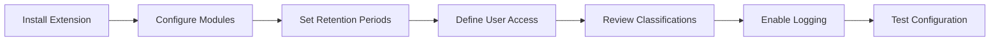

# Business Central Data Deletion Tool

A comprehensive data management and retention tool for Microsoft Dynamics 365 Business Central that helps organizations maintain data hygiene while ensuring compliance with data retention requirements.

## Architecture Overview

## Data Classification Flow

## Classification Hierarchy

## Implementation Process

## Features

### Classification System

| Priority | Type | Description | Retention |
|----------|------|-------------|-----------|
| 999 | Master/Setup | Critical system configuration | Permanent |
| 300 | Document | Transactional data | Configurable |
| 200 | History | Historical records | Limited |
| 150 | Register | Register entries | Limited |
| 100 | Ledger | Ledger entries | Required |

### Module Coverage

- System Tables
- Financial Management
- Sales & Receivables
- Purchase & Payables
- Inventory
- Manufacturing
- CRM
- Service Management
- Project Management
- Warehouse Management
- Integration Tables
- Utility Functions

## Error Handling

## Installation

1. Import the AL files into your Business Central development environment
2. Compile and publish the extension
3. Configure retention policies
4. Set up user permissions

## Configuration Steps

## Best Practices

1. Always review classifications before deletion
2. Set appropriate retention periods
3. Maintain data deletion logs
4. Regular review of retention policies
5. Test on non-production data first
6. Document company-specific policies

## Safety Features

- Pre-deletion validation
- Dependency checking
- Critical table protection
- Multi-level approval workflow
- Operation logging
- Rollback capabilities

## Support

For technical support or custom implementations, please contact the system administrator or refer to the documentation.

## License

This project is licensed under the MIT License - see the LICENSE file for details.
