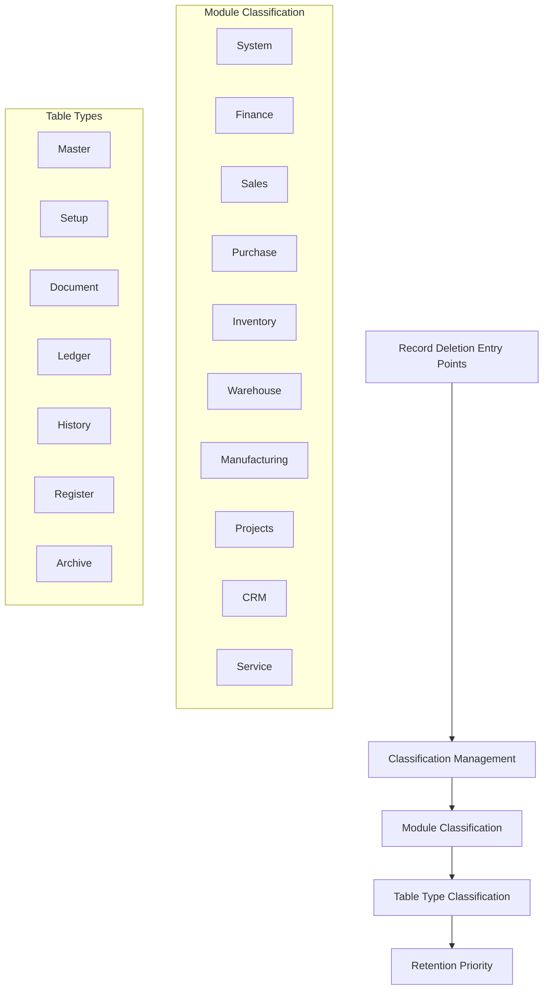
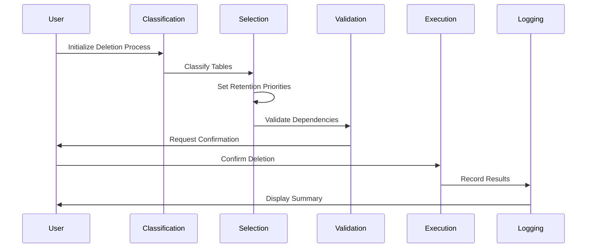
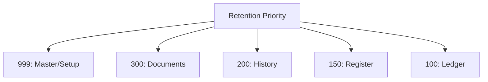
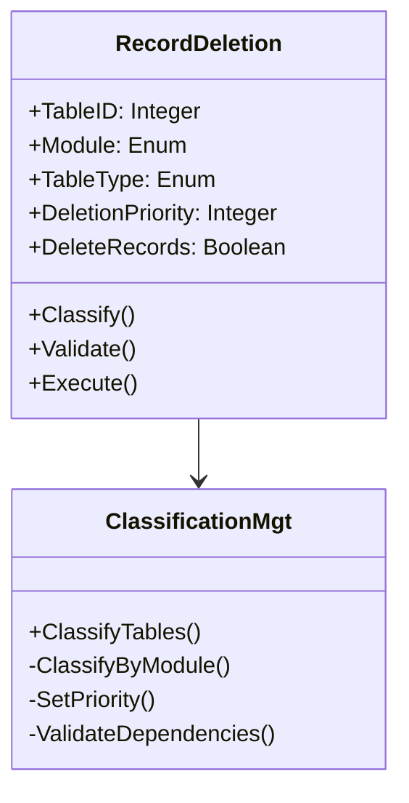
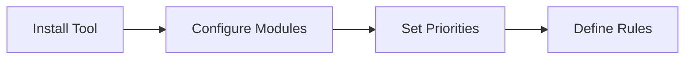
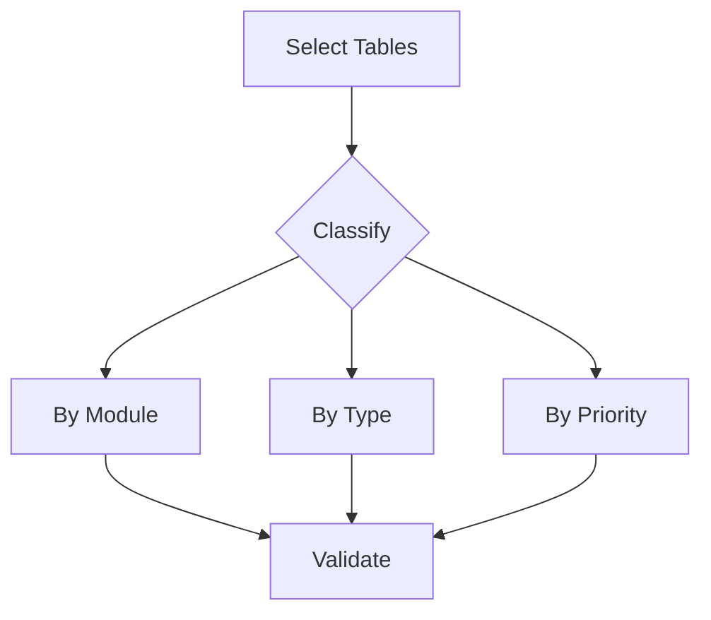
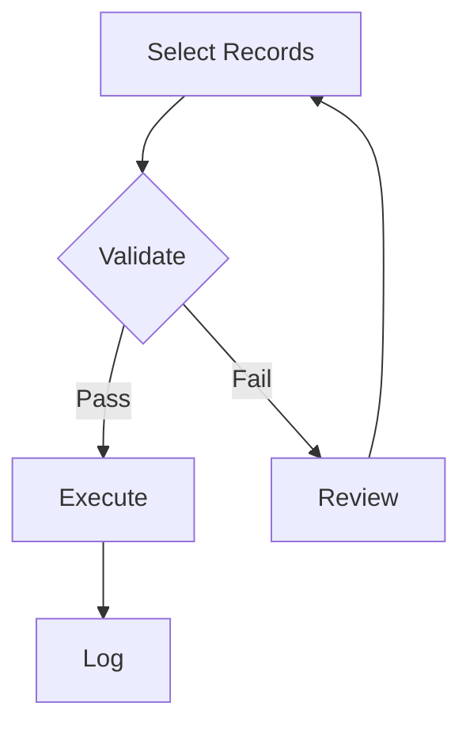
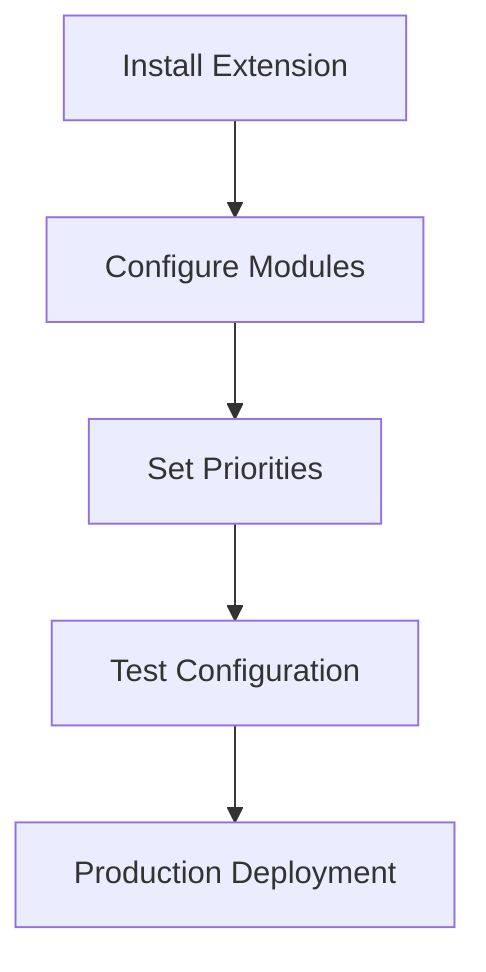
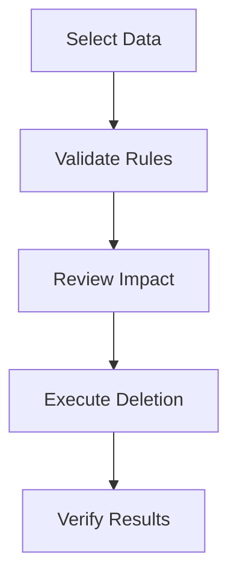
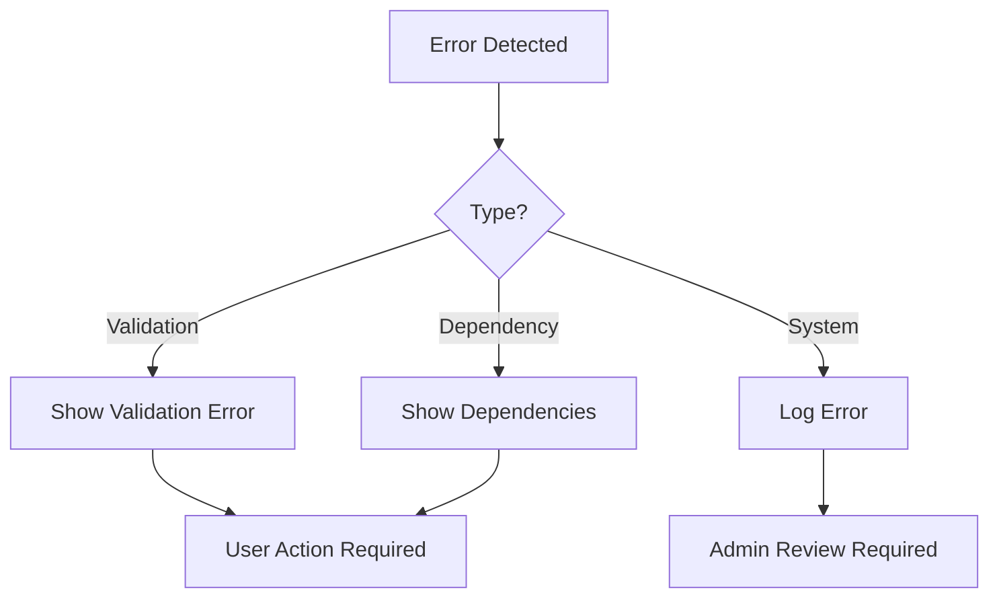

# Business Central Data Deletion Tool

A systematic data deletion and retention management tool for Microsoft Dynamics 365 Business Central.

## Architecture Overview

## Data Flow Process

## Retention Priority Structure

## Module Classification Structure

## Table Type Matrix

| Type | Priority | Description | Example |
|------|----------|-------------|---------|
| Master | 999 | Main data records | Customer, Item |
| Setup | 999 | Configuration data | Posting Setup |
| Document | 300 | Transaction data | Sales Order |
| History | 200 | Historical records | Posted Documents |
| Register | 150 | Register entries | G/L Register |
| Ledger | 100 | Ledger entries | G/L Entry |

## Usage Guide

### 1. Initial Setup

### 2. Classification Process

### 3. Execution Flow

## Features

1. **Modular Classification**
   - System-specific classifications
   - Business module classifications
   - Integration classifications

2. **Priority-based Retention**
   - Configurable retention periods
   - Priority-based deletion rules
   - Dependency management

3. **Safety Measures**
   - Dependency checking
   - Validation rules
   - Rollback capability
   - Logging and auditing

4. **Integration Support**
   - Standard BC integration
   - Extension handling
   - Cross-module dependencies

## Implementation Guidelines

### Setup Process

### Execution Process

## Best Practices

1. Always review classifications before deletion
2. Maintain backup before major deletions
3. Test on non-production first
4. Document deletion policies
5. Regular review of deletion logs

## Error Handling

## Support & Maintenance

- Regular updates for new BC versions
- Classification updates for new tables
- Performance optimization
- Bug fixes and improvements

## License

This project is licensed under the MIT License.
